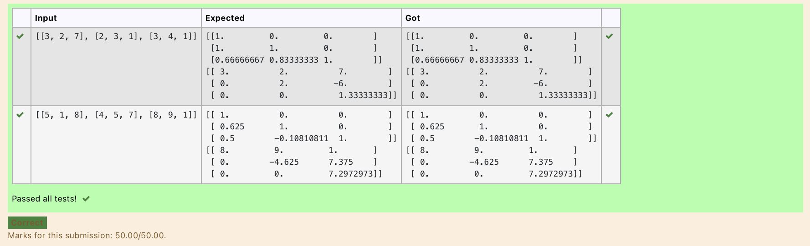
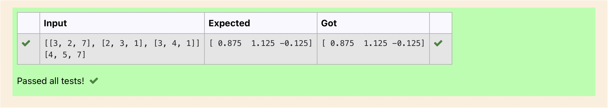

# LU Decomposition without zero on the diagonal

## AIM:
To write a program to find the LU Decomposition of a matrix.

## Equipments Required:
1. Hardware – PCs
2. Anaconda – Python 3.7 Installation / Moodle-Code Runner

## Algorithm
1. import numpy as np
2. and import scipy 
3. give the input value as given
4. print the given values.
~~~
## Program:
import numpy as np
from scipy.linalg import lu
A = np.array(eval(input()))
P, L, U = lu(A)
print(L)
print(U)
~~~
```
/*
Program to find the LU Decomposition of a matrix.
Developed by: JAGAN 
RegisterNumber: 21001404
*/
```

## Output:



## Result:
Thus the program to find the LU Decomposition of a matrix is written and verified using python programming.

________________________

## AIM:
Use LU Decomposition to solve a matrix.
## Equipments Required:
1. Hardware – PCs
2. Anaconda – Python 3.7 Installation / Moodle-Code Runner
## Algorithm
   1.import numpy as np
   2.also import scipy
   3.import the lu_factor,lu_factor
   4.give the input
   5.finally print the given variable.
 ~~~
## Program:
import numpy as np
import scipy
from scipy.linalg import lu_factor,lu_solve
A=([[3, 2, 7], [2, 3, 1], [3, 4, 1]])
B=([4, 5, 7])
lu,piv=lu_factor(A)
x=lu_solve((lu,piv),B)
print(x)
~~~
```
/*
Program to find the LU Decomposition of a matrix.
Developed by: JAGAN 
RegisterNumber: 21001404
*/
```
## Output:

## result:
Thus the program to find the LU Decomposition of a matrix is written and verified using python programming.